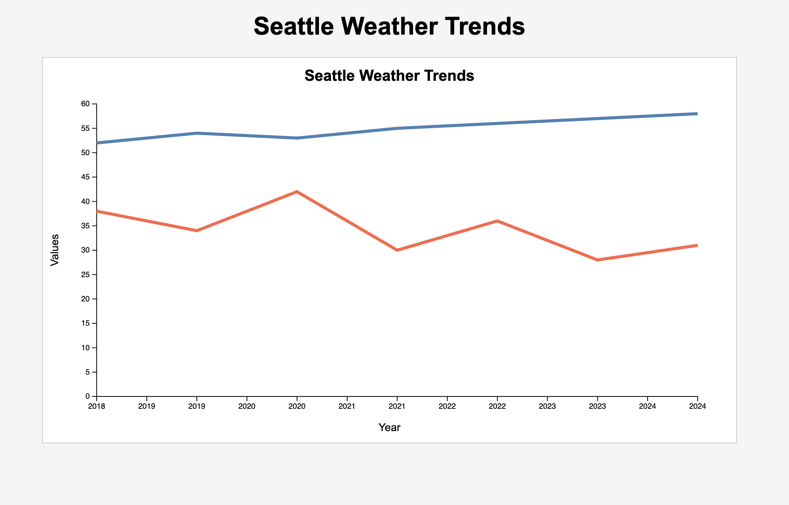

# D3 HW2 - Multi-Line Chart

This visualization shows Seattle weather trends from 2018–2024 using a multi-line chart built with D3.js and SVG.

The blue line represents average temperature and the red line represents rainfall values.

## Data Source

Synthetic Seattle weather trend data created for educational purposes.

## Visualization

